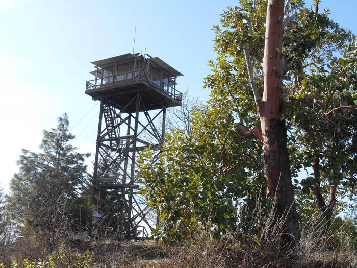

## Lookout Hunter

[View the website!](https://lookouthunter.s3.amazonaws.com/index.html)



[Fire lookout towers](https://en.wikipedia.org/wiki/Fire_lookout_tower) are scattered across public lands in [almost every American state](http://www.nhlr.org/lookouts/), and are especially prevalent on public lands in the Mountain West. Many of these towers have been decommissioned, their function replaced by satellite and airial imagery. And some of these decommissioned towers are now available to rent via Recreation.gov!

The data-processing portion of this repository finds all available rental dates over the coming months, as well as metadata about each site.

The web front-end portion of this repository visualizes and facilitates searching for rental availabilities from this data.

## Data processing

The data processing is run daily [by a GitHub Action](https://github.com/mileswwatkins/lookout_hunter/actions/workflows/get-availability.yml), but to generate the data yourself follow the below instructions.

### Requirements and setup

- Python 3.9+
- `libxml2` and `libxslt`
- Poetry
- `poetry install`

### Running

Use `poetry run data/get_availability.py` to fetch up-to-date information about sites, which will be stored in (`gitignore`'d) `data/availability.json`. This JSON file is a collection of objects, with each item having a structure like this one:

<details>
<summary>Click to view example JSON object</summary>

```json
{
  "metadata": {
    "activities": [
      "Photography",
      "Hunting",
      "Camping",
      "Mountain Biking",
      "Backpacking",
      "Hiking"
    ],
    "alternate_names": "MONU,MONUMENT,PEAK,LOOKOUT,LEWIS AND CLARK NF - FS",
    "campsites": ["71072"],
    "cancellation_description": "",
    "facility_description_map": {
      "Facilities": "The rustic lookout has two beds with mattresses, two propane lanterns, a table and chairs and a propane cooking stove. Pots, pans, dishes and utensils are included but are limited. A vault toilet is about 100 feet from the structure. \n  \nNo water, electricity or plumbing is available. Recommended items to bring include drinking water, bedding, flashlights, food, small propane canisters, firewood, matches and a cooler.  ( Click here ) for more cabin details.",
      "Natural Features": "The lookout sits at 7,395 feet in elevation, offering views of Monument Ridge and Strawberry Ridge. The surrounding region is a dense coniferous forest with fir, spruce and pine trees. \n  \nLewis and Clark National Forest has many miles of streams and fishing opportunities. Native wildlife includes black bears, mule-deer, white-tailed deer, elk, bald eagles, mountain lions and other species.",
      "Overview": "Monument Peak Lookout offers guests an impressive yet rustic room with a view. The lookout, built in 1936 by the Civilian Conservation Corps, is perched atop Monument Peak, boasting spectacular 360 degree views of the Little Belt Mountains. The lookout was once used to spot forest fires but was left unused since the 1970s. In 1999, the lookout was removed from its 50 foot pole, restored and placed on a short, solid foundation for public rental use. \nA high clearance vehicle is recommended, as the 2 miles of road leading up to the cabin are rough and rocky. During wet conditions the entie road may be muddy and often times slippery.  \nThe Lookout/Cabin is avaialble for rental between June 1 and Novemebr 30 and is closed for the remainder of the year .",
      "Recreation": "Small and big game hunting is popular in the area. Hiking, OHVing and wildlife viewing are also enjoyed. "
    },
    "facility_directions": "From Great Falls, go east on U.S. Highway 87/89 about 22 miles (just past Belt) and turn right (south) at the rest area onto U.S. Highway 89 (heading toward Monarch and Neihart). Go about 9.5 miles and turn right on County Road 340. Drive 8 miles to the junction with Road 349 and turn left (south), then drive 4.3 miles to Forest Road 839 and turn right (south). Go 8.5 miles and turn right on Road 268. Drive 3.5 miles to the lookout.\n<br/><br/>\nSnowmobiles, cross-country skis or snowshoes are required for access during most of the winter.",
    "facility_email": "",
    "facility_id": "234428",
    "facility_latitude": 46.9977778,
    "facility_longitude": -111.0983333,
    "facility_name": "MONUMENT PEAK LOOKOUT",
    "facility_phone": "406-632-4391",
    "facility_rules": {
      "maxConsecutiveStay": {
        "description": "",
        "end_date": "0001-01-01T00:00:00Z",
        "secondary_value": "",
        "start_date": "0001-01-01T00:00:00Z",
        "units": "consecutive days",
        "value": 14
      },
      "reservationCutOff": {
        "description": "",
        "end_date": "2100-01-01T00:00:00Z",
        "secondary_value": "",
        "start_date": "0001-01-01T00:00:00Z",
        "units": "",
        "value": 0
      }
    },
    "links": [
      {
        "title": "Montana State Tourism",
        "url": "http://www.visitmt.com"
      },
      {
        "title": "Montana State Road Conditions",
        "url": "http://www.mdt.mt.gov"
      }
    ],
    "notices": [
      " The cabin sleeps two people, however, two additional tents are allowed at the site (accommodating another four people). The whole facility can only provide enough room and service for six people total. Exceeding this limit is grounds for eviction without refund.",
      "No water, electricity or plumbing available",
      "Bring firewood; although there is some firewood in the area if visitors are willing to gather it",
      "<p>Clean lookout and grounds prior to departure; a fee may be charged if additional clean-up is needed. Check out time 11:00 AM.</p>\n",
      "<p>Road to the lookout is rough the last 4 miles; a high clearance vehicle is recommended. First 2 weeks of June and the month of Oct. may be walk in, due to snow conditions.</p>\n",
      "In winter, access is limited to snowmobile, cross country skiing or snowshoeing; trail is not groomed",
      "Window shutters are heavy and usually require two people to open and lock in place; hardhats are available for safety purposes while opening the shutters",
      "Flies are abundant; visitors may need to sweep up dead flies upon arrival",
      "Pets are not allowed in the cabin at any time, but can be kept outside in a kennel or on a six-foot or less leash. Users are responsible for removing all pet food and droppings from rental site prior to departure.",
      "<b>Don't Move Firewood:</b> Prevent the spread of tree-killing pests by obtaining firewood near your destination and burning it on-site. For more information visit <a href=\"http://www.dontmovefirewood.org/\" rel=\"nofollow\"> dontmovefirewood.org.</a>"
    ],
    "org_code": "FS",
    "parent_asset_id": "1018"
  },
  "attributes": {
    "details": {
      "Max Num of People": 2,
      "Checkout Time": "2:00 PM",
      "Checkin Time": "2:00 PM",
      "Min Num of People": 1,
      "Max Vehicle Length": 0,
      "Max Num of Vehicles": 0,
      "Cabin Heating": "Wood"
    },
    "amenities": []
  },
  "images": [
    {
      "mime_type": "image/jpeg",
      "height": 338,
      "width": 450,
      "url": "https://cdn.recreation.gov/public/2018/08/16/19/16/a93b11c6-1216-462b-9e52-ab37b5e0d95f_450.jpg",
      "description": "",
      "credits": ""
    },
    {
      "mime_type": "image/jpeg",
      "height": 338,
      "width": 450,
      "url": "https://cdn.recreation.gov/public/2018/08/16/19/14/64830375-f9b1-46fe-a09e-a5bcbff37d2b_450.jpg",
      "description": "",
      "credits": ""
    },
    {
      "mime_type": "image/jpeg",
      "height": 920,
      "width": 1600,
      "url": "https://cdn.recreation.gov/public/2018/07/27/20/36/54aa1716-1217-4d4b-9065-02d5fe03bc99_1600.jpg",
      "description": "",
      "credits": ""
    }
  ],
  "cell_coverage": [
    {
      "average_rating": 4,
      "carrier": "Verizon",
      "number_of_ratings": 1
    },
    {
      "average_rating": 3,
      "carrier": "AT&T",
      "number_of_ratings": 1
    }
  ],
  "rate": 45,
  "availability": {
    "2022-06-15": false,
    "2022-06-16": false,
    "2022-06-17": false,
    "2022-06-18": false,
    "2022-06-19": false,
    "2022-06-20": false,
    "2022-06-21": false,
    "2022-06-22": false,
    "2022-06-23": false,
    "2022-06-24": false,
    "2022-06-25": false,
    "2022-06-26": false,
    "2022-06-27": false,
    "2022-06-28": false,
    "2022-06-29": false,
    "2022-06-30": false,
    "2022-07-01": false,
    "2022-07-02": false,
    "2022-07-03": false,
    "2022-07-04": false,
    "2022-07-05": false,
    "2022-07-06": false,
    "2022-07-07": false,
    "2022-07-08": false,
    "2022-07-09": false,
    "2022-07-10": false,
    "2022-07-11": false,
    "2022-07-12": false,
    "2022-07-13": false,
    "2022-07-14": false,
    "2022-07-15": false,
    "2022-07-16": false,
    "2022-07-17": false,
    "2022-07-18": false,
    "2022-07-19": false,
    "2022-07-20": false,
    "2022-07-21": false,
    "2022-07-22": false,
    "2022-07-23": false,
    "2022-07-24": false,
    "2022-07-25": false,
    "2022-07-26": false,
    "2022-07-27": false,
    "2022-07-28": false,
    "2022-07-29": false,
    "2022-07-30": false,
    "2022-07-31": true,
    "2022-08-01": false,
    "2022-08-02": false,
    "2022-08-03": false,
    "2022-08-04": false,
    "2022-08-05": false,
    "2022-08-06": false,
    "2022-08-07": false,
    "2022-08-08": false,
    "2022-08-09": false,
    "2022-08-10": false,
    "2022-08-11": false,
    "2022-08-12": false,
    "2022-08-13": false,
    "2022-08-14": false,
    "2022-08-15": false,
    "2022-08-16": false,
    "2022-08-17": false,
    "2022-08-18": false,
    "2022-08-22": false,
    "2022-08-23": false,
    "2022-08-24": false,
    "2022-08-25": false,
    "2022-08-26": false,
    "2022-08-27": false,
    "2022-08-28": false,
    "2022-08-29": false,
    "2022-08-30": true,
    "2022-08-31": true,
    "2022-09-01": true,
    "2022-09-02": false,
    "2022-09-03": false,
    "2022-09-04": false,
    "2022-09-05": false,
    "2022-09-06": false,
    "2022-09-07": false,
    "2022-09-08": false,
    "2022-09-09": false,
    "2022-09-10": false,
    "2022-09-11": false,
    "2022-09-12": true,
    "2022-09-13": true,
    "2022-09-14": true,
    "2022-09-15": true,
    "2022-09-16": false,
    "2022-09-17": false,
    "2022-09-18": true,
    "2022-09-19": true,
    "2022-09-20": false,
    "2022-09-21": false,
    "2022-09-22": false,
    "2022-09-23": false,
    "2022-09-24": false,
    "2022-09-25": false,
    "2022-09-26": false,
    "2022-09-27": false,
    "2022-09-28": false,
    "2022-09-29": false,
    "2022-09-30": false
  }
}
```

</details>

### Contributing additional lookouts

All currently-known Recreation.gov `facility_id`s for this project are stored within `compiled_facility_ids.txt`. If you know of any _additional_ IDs, please add them!

- If they're one-off additions, simply add them to the `data/manually_entered_facility_ids.txt` file, one ID per line, with a comment (starting with `#`) on where the IDs were sourced from
- If you have an entirely new data source, you can add a scraper for that in `data/compile_facility_ids.py`, and commit any changes to the `data/compiled_facility_ids.txt` file as well. Alternatively, if you're not comfortable writing a Python scraper, you can let me know about the data source by [filing a GitHub Issue](https://github.com/mileswwatkins/lookout_hunter/issues)!

Otherwise, maybe once per year `poetry run data/compile_facility_ids.py` should be run to update the text file of IDs.

## Web front-end

The front-end is hosted as a website [here](https://lookouthunter.s3.amazonaws.com/index.html) on AWS S3, but if you want to develop it follow the directions below.

### Requirements

- Node 20
- `npm install`

### Running

Use `npm run start`, which runs the app and makes it available at http://localhost:3000.

### Deployment

Run `npm run deploy` to build and deploy to AWS S3. This requires AWS credentials for the S3 bucket in question.

More commonly, you'll [use GitHub Actions](https://github.com/mileswwatkins/lookout_hunter/actions/workflows/deploy-frontend.yml) to deploy the front-end.
